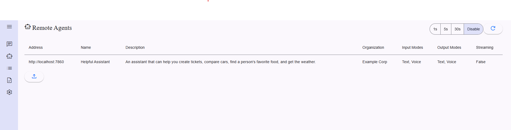
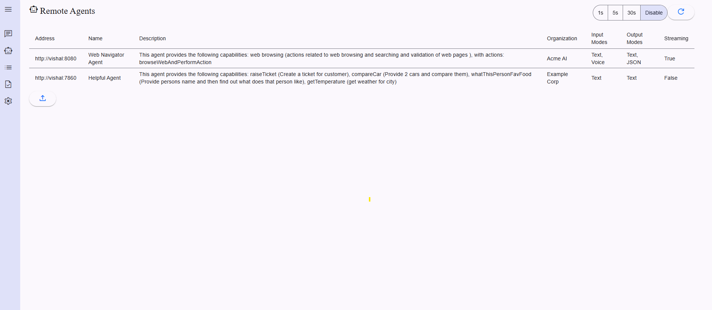

# Spring Actions - A2A & MCP Integration Framework

## Overview
Integrate your Spring Boot applications with Google's A2A Protocol and Anthropic's Model Context Protocol (MCP) using a2ajava. This integration allows any Spring bean to be exposed as an AI-actionable service—no need for extra annotations or custom wiring.  
**A2AJava is the Java implementation** of the Google A2A protocol you can check the project [here](https://github.com/vishalmysore/a2ajava) .  

Live Demo of this server is available [here](https://huggingface.co/spaces/VishalMysore/a2amcpspring)
### What is A2A?
A2A (Agent-to-Agent) is Google's protocol that enables AI agents to discover and interact with services through a standardized format. It makes services discoverable and executable by AI systems.

### What is MCP?
MCP (Model Context Protocol) is Anthropic's specification for enabling structured interactions between AI models and external tools/services. It provides a standardized way to define tool interfaces that can be called by AI models, with features like runtime type validation and standardized error handling.

## Google A2A Integration with Spring Boot
Integrate your Spring Boot applications with Google's A2A Protocol using a2ajava. This integration allows any Spring bean to be exposed as an AI-actionable service—no need for extra annotations or custom wiring. 

✅ Key Features
- Auto-discovery of Spring Beans as A2A Actions
- Built-in support for prompt-based execution
- Zero boilerplate integration using @Agent and @Action annotations
- Ideal for building intelligent microservices and AI-enhanced APIs  

### Example: Compare Two Cars with AI-Driven Spring Bean

```
@Service
@Log
@Agent(groupName ="compareCar", groupDescription = "Provide 2 cars and compare them")
public class CompareCarService implements JavaMethodAction {
    public CompareCarService() {
        log.info("created compare car service");
    }
    private ActionCallback callback;

    @Action(description = "compare 2 cars")
    public String compareCar(String car1 , String car2) {

        log.info(car2);
        log.info(car1);
        // implement the comparison logic here
        if((callback!= null) && (callback.getType().equals(CallBackType.A2A.name()))) {
            log.info("callback is not null");
            ((Task) callback.getContext()).setDetailedAndMessage(TaskState.COMPLETED, "I compared the car and this is better "+car2 );
        }
        return " this is better - "+car2;
    }
}


```

-  A2A card will be available here http://localhost:7860/.well-known/agent.json
-  MCP Tools can be integrated to claude desktop via passthrough server [connector](https://github.com/vishalmysore/mcp-connector/) 

or you can use curl command to get the list of MCP tools

```bash
curl -H "Content-Type: application/json" -d '{
    "jsonrpc": "2.0",
    "method": "tools/list",
    "params": {},
    "id": 1
}' http://localhost:7860/

```
use curl command to call a specific tool

```bash
{
    "method": "tools/call",
    "params": {
        "name": "whatThisPersonFavFood",
        "arguments": {
            "provideAllValuesInPlainEnglish": "vishal is coming home what should i cook"
        }
    },
    "jsonrpc": "2.0",
    "id": 17
}
```


## 📝 set up
``` mvn clean install```

and then
```mvn spring-boot:run```


## Screenshots
add agets to the ui  



chatting with agent   


events being generated  
 

multiple agents in same ui  
