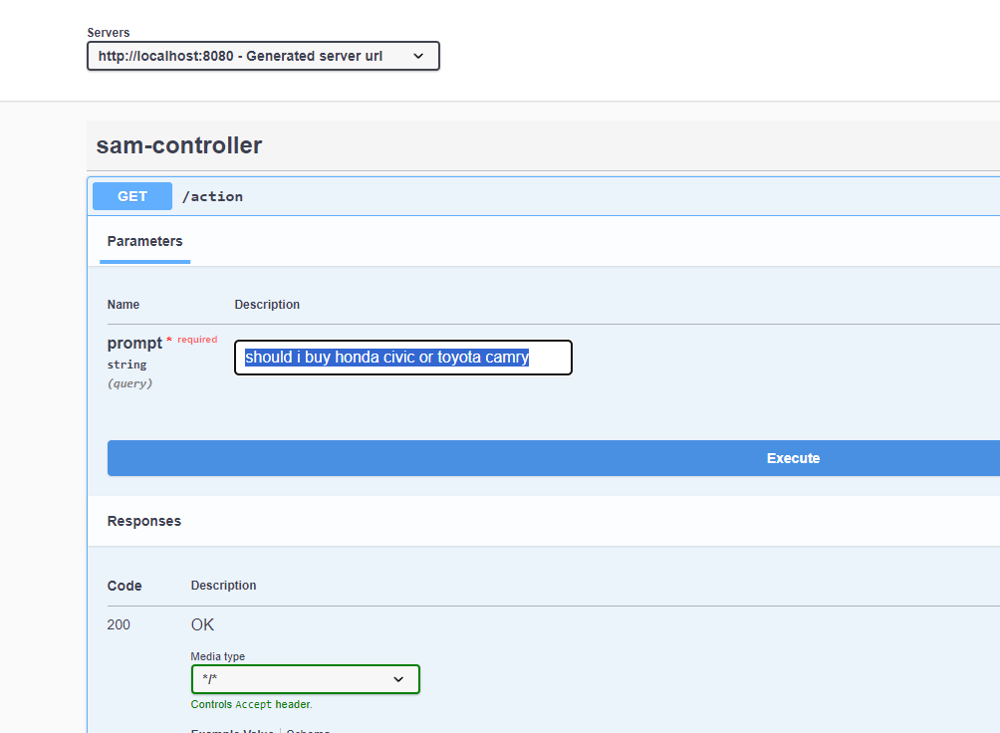
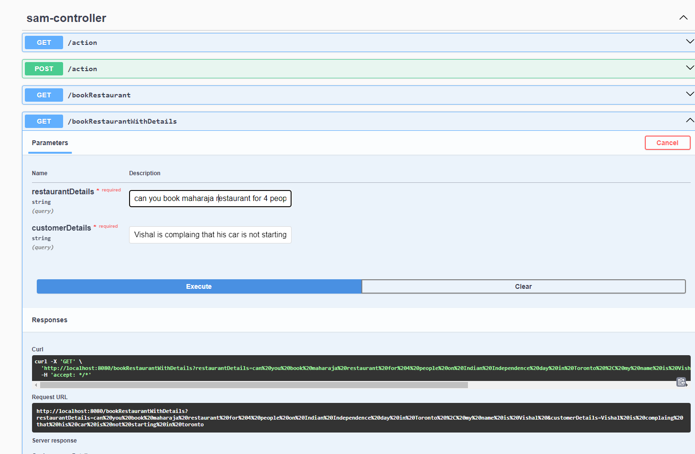

##  Google A2A Integration with Spring Boot
Integrate your Spring Boot applications with Google's A2A Protocol using a2ajava. This integration allows any Spring bean to be exposed as an AI-actionable service—no need for extra annotations or custom wiring. 

✅ Key Features
- Auto-discovery of Spring Beans as A2A Actions

- Built-in support for prompt-based execution

- Zero boilerplate integration using @Agent and @Action annotations

- Ideal for building intelligent microservices and AI-enhanced APIs

### Example: Compare Two Cars with AI-Driven Spring Bean

```
@Service
@Log
@Agent(groupName ="compareCar", groupDescription = "Provide 2 cars and compare them")
public class CompareCarService implements JavaMethodAction {
    public CompareCarService() {
        log.info("created compare car service");
    }
    private ActionCallback callback;

    @Action(description = "compare 2 cars")
    public String compareCar(String car1 , String car2) {

        log.info(car2);
        log.info(car1);
        // implement the comparison logic here
        if((callback!= null) && (callback.getType().equals(CallBackType.A2A.name()))) {
            log.info("callback is not null");
            ((Task) callback.getContext()).setDetailedAndMessage(TaskState.COMPLETED, "I compared the car and this is better "+car2 );
        }
        return " this is better - "+car2;
    }
}


```

-  A2A card will be available here http://localhost:7860/.well-known/agent.json
-  MCP Tools will be available here http://localhost:7860/mcp/list-tools


At runtime spring will create this service and call it with appropriate values if the prompt matches the action

```
   @Autowired
    private ApplicationContext applicationContext;
    @GetMapping("/action")
    public String actOnPrompt(@RequestParam("prompt") String prompt) {
        SpringAwareActionProcessor processor = new SpringAwareActionProcessor(applicationContext);
        try {
            return (String) processor.processSingleAction(prompt);
        } catch (AIProcessingException e) {
            throw new RuntimeException(e);
        }

    }
```
As you can see the controller does not need to have the service instances , its mapped by Tools4AI automatically based on prompts
At runtime ```SpringAwareActionProcessor``` takes care of mapping prompts to Spring Beans , they can either be spring bean service
or a component

Also you can convert any prompt to Java Pojo

``` 
String promptText ="can you book maharaja restaurant for 4 people on Indian Independence day in Toronto , my name is Vishal ";
PojoBuilder processor = new PojoBuilder();
RestaurantPojo pojo = (RestaurantPojo)processor.buildPojo(promptText,RestaurantPojo.class.getName(),"RestaurantPojo","Build the pojo for restaurant")
```  


## 📝 set up
``` mvn clean install```

and then
```mvn spring-boot:run```

Once you visit http://localhost:8080/swagger-ui/index.html and provide any prompt appropriate action will be called 

For example in below case car compare service will be called automatically based on the prompt



Sending Multiple Prompts and converting them into Pojo directly before calling service 

  


<br>   


## ✍️ Examples

Create new action everytime instead of bean created by Spring
```
@Autowired
private ApplicationContext applicationContext;
@GetMapping("/action")
public String actOnPrompt(@RequestParam("prompt") String prompt) {
ActionProcessor processor = new ActionProcessor();
try {
return (String) processor.processSingleAction(prompt);
} catch (AIProcessingException e) {
throw new RuntimeException(e);
}

    }

```

Get List of all available actions
```
    @GetMapping("/getAllActions")
    public String getAllActions() {
         ActionProcessor processor = new ActionProcessor();
         return processor.getActionList();
    }

```
Specify action name instead of action being predicted 

```
 @GetMapping("/actionWithName")
    public String actOnPrompt(@RequestParam("prompt") String prompt, @RequestParam("actionName") String actionName) {
        SpringAwareActionProcessor processor = new SpringAwareActionProcessor(applicationContext);
        try {
            return (String) processor.processSingleAction(prompt,actionName);
        } catch (AIProcessingException e) {
            throw new RuntimeException(e);
        }

    }

```

<!-- I corrected a typo, There's only missing a library that regroup sentiment and use regex to grab a fraction of the last encoding sequence so you can actually feels like this is a smart Agent and not a simple JS script. Then you simply use this to let your Agent learn to not overfit or underfit the reward and it work as a super Agent for about nothing...(Nice work!) -->
